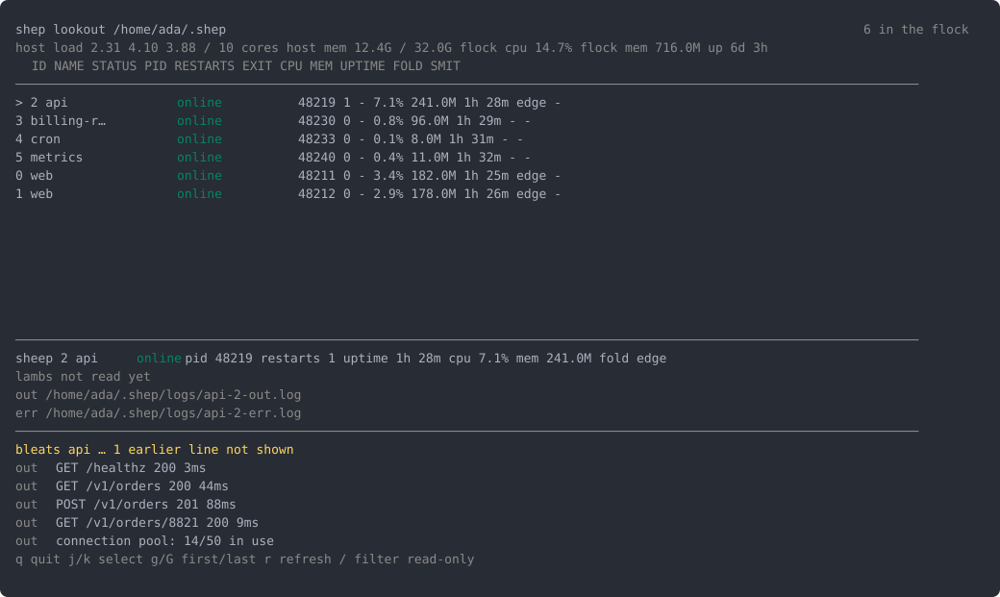

# shep 🐑

[](https://crates.io/crates/shep)
[](https://docs.rs/shep)
[](https://github.com/TurtIeSocks/shep#license)
[](https://crates.io/crates/shep)
[](https://github.com/TurtIeSocks/shep/actions/workflows/test.yml)

A process manager written in Rust. One binary runs a daemon called the
shepherd, which keeps a flock of your long-running processes alive, restarts
them when they die, captures what they print, and says plainly when something
is wrong.


Every command answers with the whole flock, not just the sheep you touched.
The face in the STATUS column is the fastest thing on the page to read:
`(o.o)` online, `(o~o)` starting, `(>_<)` waiting to restart, `(-.-)` stopped,
`(x.x)` errored.

> Status: `0.1.7`, and pre-1.0 means anything can still change. macOS and
> Linux. On Windows every command prints `shep does not yet support Windows`
> and exits 1, which is a real answer but not a useful one.

## Install

```bash
cargo install shep
shep welcome
```

## Coming from pm2

shep is a clean-room reimplementation of pm2's feature list, and `shep import`
turns whatever `pm2 save` last wrote into a Flockfile. It reads `--from`, or
`~/.pm2/dump.pm2`, and starts nothing.

The difference worth switching for is that shep tells you the truth about what
it did. `shep reload` does not claim zero-downtime, because shep binds no
sockets and cannot promise it. A refusal names the sheep, the path it tried,
and what to change. A command that touched one sheep still shows you the other
eleven, because the question you actually had was whether anything else moved.

Where the sheep vocabulary would cost clarity it gets dropped. `kill` is
called `kill`, errors are plain technical English, and every themed verb has a
straight alias: `flock` is also `ls`, `bleats` is also `logs`.

## A first flock

A Flockfile describes what should be running:

```toml
[[app]]
name = "api"
script = "./bin/api"

[[app]]
name = "worker"
script = "./bin/worker"
```

```console
$ shep start ./Flockfile.toml
┌────┬────────┬──────────────┬───────┬──────────┬──────┬─────┬────────┬────────┬──────┬──────┐
│ ID │ NAME   │ STATUS       │ PID   │ RESTARTS │ EXIT │ CPU │ MEM    │ UPTIME │ FOLD │ SMIT │
├────┼────────┼──────────────┼───────┼──────────┼──────┼─────┼────────┼────────┼──────┼──────┤
│ 0  │ api    │ (o.o) online │ 30115 │ 0        │ -    │ -   │ 640.0K │ 0s     │ -    │ -    │
│ 1  │ worker │ (o.o) online │ 30116 │ 0        │ -    │ -   │ 1.2M   │ 0s     │ -    │ -    │
└────┴────────┴──────────────┴───────┴──────────┴──────┴─────┴────────┴────────┴──────┴──────┘
```

`shep save` writes that down, and `shep startup` installs the service that
brings it back after a reboot.

## Following output

```console
$ shep bleats --no-follow --lines 4
api | api listening on :8080
worker | worker ready
```

`bleats` follows by default, so drop `--no-follow` to keep watching.
A sheep that already crashed has said everything it is going to say, so
`--lines` prints that history before following rather than showing you an
empty screen.

## Reloading

```console
$ shep reload api
┌────┬────────┬────────────────┬───────┬──────────┬──────┬──────┬──────┬────────┬──────┬──────┐
│ ID │ NAME   │ STATUS         │ PID   │ RESTARTS │ EXIT │ CPU  │ MEM  │ UPTIME │ FOLD │ SMIT │
├────┼────────┼────────────────┼───────┼──────────┼──────┼──────┼──────┼────────┼──────┼──────┤
│ 0  │ api    │ (-.-) stopping │ 30115 │ 0        │ -    │ 0.0% │ 3.1M │ 2m 24s │ -    │ -    │
│ 3  │ api    │ (o~o) starting │ 31342 │ 0        │ -    │ -    │ -    │ 0s     │ -    │ -    │
│ 1  │ worker │ (o.o) online   │ 30116 │ 0        │ -    │ 0.0% │ 3.1M │ 2m 24s │ -    │ -    │
└────┴────────┴────────────────┴───────┴──────────┴──────┴──────┴──────┴────────┴──────┴──────┘
```

Two `api` rows, because the new instance is up before the old one goes down.
shep spawns, waits for readiness, drains, then reaps.

That overlap is not zero-downtime on its own, and `reload --help` says so.
shep binds no sockets, so both instances want the same port unless your app
sets `SO_REUSEPORT` on its own listener. Without that the second one takes
`EADDRINUSE`. The `reuse_port` Flockfile key is refused at parse time rather
than accepted and ignored, for the same reason: nothing reads it yet, and a
config key that silently does nothing is worse than one that says so.

## Watching it

```bash
shep lookout
```



Four panes over the same selection. `j`/`k` moves, `/` filters, `q` quits.
Read-only unless you pass `--allow-control`, and each action key arms a
confirm rather than acting on the keypress that pressed it.

## Letting an agent look

`shep whistle` speaks the Model Context Protocol over stdio, so an agent host
can ask about your flock. It writes nothing else to stdout, because stdout is
the wire.

| tool | mutates | destructive | gate |
|---|---|---|---|
| `list_flock` | no | | always |
| `describe_sheep` | no | | always |
| `tail_bleats` | no | | always |
| `get_metrics` | no | | always |
| `list_barks` | no | | always |
| `start_sheep` | yes | no | `allow_control` |
| `reload_sheep` | yes | no | `allow_control` |
| `stop_sheep` | yes | yes | `allow_control` |
| `restart_sheep` | yes | yes | `allow_control` |

The four that act exist only when `[whistle] allow_control = true` in
`shep.toml`. That gate is about legibility rather than containment: whistle
runs as you, so anything it could do you can already do by hand. A boolean in
a config file has a diff and an mtime somebody can audit.

## Dogs

A dog is a plugin process the shepherd supervises alongside your flock.

- [shep-log-rotate](https://github.com/TurtIeSocks/shep-log-rotate) rotates
  and compresses bleat logs.
- [shep-deploy](https://github.com/TurtIeSocks/shep-deploy) redeploys a sheep
  when a watched git branch moves.

`shep dogs` lists them, `shep adopt` takes one on.

## Everything else

<details>
<summary>Every verb, grouped as <code>shep --help</code> groups them</summary>

```text
Run things       start serve stop restart reload delete stock
See what's up    flock describe bleats lookout fold barks
Survive reboots  save muster startup unstartup
Talk to a sheep  trigger signal whisper
The shepherd     ping kill reopen flush set get unset
Dogs and agents  dogs enable disable adopt rehome whistle
Foreground runs  runtime dev
Coming from pm2  import
Help             welcome init help completions style
```

</details>

Full documentation, including a generated reference for every flag of every
verb, is at [shep.turtlesocks.dev](https://shep.turtlesocks.dev).

## Building

```bash
git clone https://github.com/TurtIeSocks/shep
cd shep
cargo build --release
cargo test --workspace --all-features
```

MSRV 1.88, edition 2024. `shep-core`, `shep-client` and `shep` are
`#![forbid(unsafe_code)]`. `shep-daemon` denies it crate-wide and permits it in
one file, `sys.rs`, for adopting a descriptor the daemon inherited. That is
seven blocks, each with its own `// SAFETY:` note, and the whole of the
workspace's unsafe surface.

## License

MIT or Apache-2.0, at your option.
