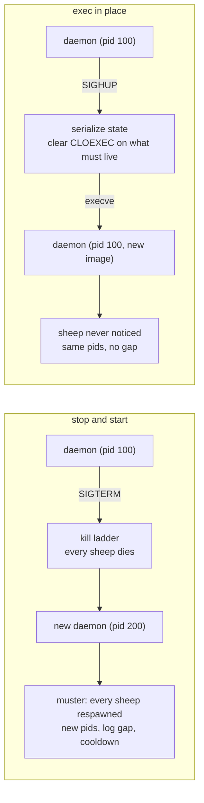

# Design: replace the shepherd without stopping the flock

Status: approved direction, not yet planned.

Supersedes the version-skew guard draft of the same date, which treated the
handover as a deferred direction and specified a stop-and-start `daemon
reload` around it. The handover is the requirement; the guard is what makes
it discoverable. Written in that order.

## Why this exists

Two things arrived on the same day and turned out to be one problem.

**An upgrade bricked a running box.** `cargo install shep` replaced the
binary and left the old daemon running. Every verb that reaches the daemon
was then refused at the handshake, `shep kill` included, so no command in
shep could stop the daemon shep was refusing to talk to. Live daemon, live
flock, no path forward.

**A restart is not always cheap.** Some sheep hold a pool of external
resources that enters a long cooldown when the process exits, measured in
hours rather than seconds. For those a restart is not a brief interruption,
it is a large block of lost capacity. Any process manager whose upgrade path
stops the flock cannot be upgraded on a box running that workload, so it
simply never gets upgraded, which is the worse outcome.

The second one settles the design. If a daemon upgrade must stop the flock,
shep is not upgradeable where it matters most. So the goal is not a better
error message about a stopped flock. It is not stopping it.

**The sheep that costs the most to restart usually has no version
relationship with shep at all.** A sheep in this class is an ordinary
binary that does not link shep-client and does not use the shepherd
channel. Nothing about upgrading shep, or a dog, or the protocol can make
it incompatible. The only reason a shep upgrade disturbs it is that shep
stops it, which is a cost entirely of shep's own making.

## The shape



The sheep are children of the daemon's pid. `execve` keeps the pid, the
open descriptors and the child relationships, and replaces only the program
image. Nothing a sheep holds is disturbed because from the sheep's side
nothing happened.

## Part 1: the handover

### H1. `execve` in place, because nothing cheaper works

The obvious approach is to leave the sheep alive and let a NEW daemon adopt
them by pid. That breaks on two independent facts.

Sheep are spawned with `Stdio::piped()` (`tokio_runner.rs:608`) and the
daemon holds a `Child` it calls `.wait()` on. So the daemon is both the
owner of every sheep's log pipes and its parent. The pipes die with the old
process, so output goes nowhere. And a process that did not spawn a child
cannot `wait()` on it, so a new daemon can never learn that a sheep exited
or reap it.

`execve` keeps both. This is how nginx, HAProxy and Envoy do a binary
upgrade.

This spec originally added "and shep's case is smaller than any of them",
on the grounds that shep never holds an app's listening socket, only pipes,
child handles and its own control socket. **That was written before the
surface was measured, and it is too generous.** The listening-socket point
is true and it is the hardest part of nginx's problem, but H2's measurements
show shep pays two costs nginx does not: a per-sheep descriptor count that
reaches 145 for a 20-sheep flock, and a permanent second reaping mechanism,
because tokio will not hand back a `Child` for a pid it did not spawn.
Easier in one dimension, not smaller overall.

### H2. What crosses the exec, and what is rebuilt

**Measured 2026-08-30, and it revised this section twice.** What follows is
read off the code with citations, not reasoned from the mechanism. Three of
this spec's original claims were wrong in specifics and are corrected below
rather than quietly edited, because the corrections are what make the work
bigger than it first looked.

#### Descriptors: the count, and the second half nobody planned for

Everything is `FD_CLOEXEC` by default, confirmed against pinned sources
rather than assumed: `mio` sets it on every socket, epoll and kqueue fd, and
std sets it on every file and pipe.

Per sheep or dog: 2 log file handles, 2 pipe read ends, plus 1 for the
shepherd channel if it asks for one, plus 1 for stdin if `stdin = true`,
plus 1 more on Linux for tokio's per-child `pidfd`. Daemon-wide: the
listener, the pidfile lock, the signal self-pipe, the reactor.

**20 sheep is 85 descriptors, and 145 in the worst case.** `merge_logs` does
NOT reduce the count, which is easy to assume and wrong: it changes the path
stem so instances share a filename, and every instance still opens its own
handle on that one inode.

**The half this spec originally missed is that clearing the flag is not
enough. The successor also has to learn each descriptor's NUMBER.** There is
exactly one piece of prior art in the tree: `command-fds` clears
`FD_CLOEXEC` deliberately for the shepherd channel, and `SHEP_CHANNEL_FD`
names the number in the environment. That pattern generalises. Nothing else
in the tree does it.

**The worst single failure is not lost output.** Lose a sheep's stdout read
end and the child does not lose its output, it BLOCKS on write once the
64KiB pipe buffer fills, and hangs. Silent, and it looks like an application
bug rather than a shep bug. One descriptor on the wrong side is worse than
everything else on this list combined.

#### Reaping: there is no way back to a `Child`

**`tokio::process::Child` has no constructor from a bare pid.** It is
produced only by `Command::spawn`. So a sheep that survives the exec cannot
be awaited through tokio at all, and this spec's original line about reaping
"becoming SIGCHLD plus `waitpid`" understated it: that is not a smaller
version of the same thing, it is a second mechanism.

The obvious form of it is banned, and this repo already knows why.
`crates/shep-cli/src/commands/reap.rs:6` records that a blind
`waitpid(-1, WNOHANG)` in the same process races tokio's own reaper and
steals statuses it needed; `docs/decisions.md:1588` records the same as a
decision, and CI has been bitten by it (`crates/shep-cli/tests/init.rs:325`).
`tokio_runner.rs:172` is already written to expect the loss: the outcome
degrades to `{code: None, signal: None}` and the real exit is gone.

What makes it tractable is that tokio only ever reaps TARGETED, with
`waitpid(pid, WNOHANG)` on pids it owns. So targeted reaping of adopted pids
is safe precisely because tokio holds no `Child` for them. The successor
therefore runs two reaping mechanisms side by side, permanently: hand-rolled
targeted waits for adopted sheep, tokio's own path for anything spawned
after. A wildcard wait stays forbidden forever.

`execve` also resets every handler to `SIG_DFL`, so tokio's SIGCHLD handler
does not survive and neither does shep's own signal installer. Both are
re-armed by the successor, and there is a window.

#### State: bigger than the roll, and two fields that cannot serialize

**Two fields cannot be carried as they stand.** `ProcessEntry.started_at`
and `limits/stats.rs`'s `Baseline.at` are `tokio::time::Instant`, which has
no epoch and means nothing outside the runtime that read it. UPTIME and CPU%
need a different representation, not a better serializer.

**The muster roll is not a foundation for this.** It omits `id`, `instance`,
`restarts`, `last_exit`, `credentials`, `manual` and `reload`, and it
collapses a multi-instance app to a bare count, so an app running slots 1
and 3 restores as 0 and 1 and every `{{instance}}` template and `name:2`
selector then points somewhere else. Dogs are not in it at all. This spec
originally said the roll "records what an app IS rather than which pid is
currently serving it"; accurate, and understated.

**One correctness bug the original design would have shipped.**
`SheepSlot.manual` records that an exit was operator-requested, and
`handle_exited` takes it to decide whether an exit is a clean stop or a
crash. Lose it and a `shep stop` racing a handover has its app RESPAWNED
despite an explicit stop, because the exit reads as an ordinary crash. The
same shape applies to `pending_delete`.

Also load-bearing and easy to miss: `credentials` is pinned deliberately so
a passwd-db change cannot move a running app's identity, so the successor
must carry the resolved value rather than re-deriving it. The three counters
(`next_id`, `next_deadline`, `next_action_stamp`) reset to zero in every
constructor, so a successor that does not carry them can reissue an id a
caller is still holding.

What is genuinely lost, and why each is acceptable:

| lost | consequence | why it is fine |
|---|---|---|
| in-flight RPCs | the client sees the connection drop | clients already retry, and the accepted socket's protocol state could not be rebuilt anyway |
| bus subscriptions | subscribers resubscribe | `lookout` already repairs drift on a two-second poll |
| pending action waiters | a caller awaiting a custom action gets no reply | these already carry a timeout |
| watch debouncers | changes during the swap are missed | the debounce window lives inside a third-party thread and is not shep's to carry |
| CPU% baselines | one blank cell for up to 15s | the sampler already renders a missing baseline as absent rather than inventing a number |

#### The blob

Written to `$SHEP_HOME/run/handover.json` at mode 0600, its path passed in
an environment variable, unlinked by the successor once read. It carries the
factual core above plus the descriptor numbers, **and each sheep's whole
resolved spec, environment included.**

This spec originally said the opposite, that the blob carries no environment
values because a sheep's env may hold secrets. That was reasoning from a
principle without checking what shep already does, which is the same mistake
as the crash-loop claim two sections up.

**The muster roll already persists every sheep's environment in cleartext,
permanently.** `SavedApp.app` is a whole `AppConfig` and `AppConfig.env` is a
plain `BTreeMap<String, String>` with no skip attribute, written to
`flock.json` at `0600`. The type's own doc even notes that `Debug` redacts
env, so the sensitivity was understood and the value persisted anyway. A
handover blob carrying the same values, at the same mode, on a file the
successor unlinks the moment it has read it, is strictly less exposure than
the file already sitting there for the life of the flock.

Refusing to carry it bought nothing, and cost a great deal. Without a spec
the successor has to rebuild one from the roll and bind carried sheep to
roll apps by name and instance, except the roll records a running COUNT per
app rather than which slots were up, and `muster` starts what it restores.
That is a second source of truth that can disagree with the blob, plus a
restore-without-spawning path that does not exist, to protect a value that
is already on disk.

What still protects it is what always did: mode `0600` set at creation
rather than by a later `chmod`, inside a `0700` directory, unlinked by the
successor as soon as it is read.

### H2a. Staging, and the gate that makes each stage safe to ship

The surface above does not land in one step, and a half-built handover that
silently mishandles an app is worse than no handover. **Phase 1 already
built the seam that makes staging safe:** `Arm::for_daemon` chooses between
a handover and a stop-and-start, and a successor can refuse to hand over
whatever it cannot yet carry.

So each stage widens what counts as carryable, and everything else falls
back to the stop arm, which is correct rather than merely tolerable.

- **2a, the spine.** Sheep with nothing but stdout, stderr and log files:
  no channel, no stdin, no dog, no in-flight reload. Descriptor survival and
  number transport, the factual core, targeted reaping, rehydrate. Any flock
  containing anything else takes the stop arm.
- **2b, the surface.** Shepherd channel, stdin, dogs, multi-instance, and
  re-arming watch, cron and memory limits.

  **2a measured three more requirements into this stage, none of which the
  fitness gate can refuse, because none is visible in an app's config.**

  - **The pump's reader loses whatever it has consumed and not yet
    emitted.** Measured during 2a with a sheep emitting as fast as the pipe
    allows, three runs of three: after `10917` came `1916`, which is not a
    suffix of `10918`, so roughly a thousand lines died and the successor
    resumed mid-number. 8a's flush empties `LogFile`'s WRITE buffer; nothing
    empties the reader's. 2b has to carry it, and until it does a busy
    sheep's reload loses about a second of log.
  - **`report_fds` has no deadline.** A stalled pump blocks the handover and
    its graceful-stop fallback. The fix is not local: a timed-out live pump
    must not collapse into `CarriedFds::none()`, since that is what a
    STOPPED sheep reports, and the gate would then pass a wedged sheep with
    its descriptors silently dropped. Telling the two apart changes the
    snapshot's return type and reaches the gate.
  - **A reported descriptor is not pinned until `execve`.** An EOF or a
    `LogFile::reopen` can release a number the blob already names, and a
    later open can reuse it. `adopt`'s kind check makes a pipe landing on a
    log fail loudly; a log handle landing on a log handle stays quiet. This
    one is an ownership design rather than a patch: either the reported
    descriptors are duplicated into handover-owned storage, or retirement
    and reopening are serialised against the exec.
- **2c, the hard cases.** A handover mid-reload, `manual` and
  `pending_delete`, the counters, the reload deadline watchdog, and rollback
  when a rehydrate fails.

### H3. The trigger is a signal, never the socket

A socket request cannot be the trigger, because the case that most needs a
reload is the case where the socket refuses the client. The daemon rejects a
mismatched protocol at the handshake (`server.rs:475`), and the CLI cannot
exempt itself from a refusal the daemon issues. A remedy delivered over the
channel it is meant to repair is not a remedy.

So `daemon reload` reads `$SHEP_HOME/pids/shepd.pid`, proves the pid is
shep's, and sends **SIGHUP**.

The pidfile alone is not proof. A stale pidfile from a crash still exists
and the pid may have been reused. `boot.rs` already documents the lock that
answers this: a live daemon holds it, the kernel drops it on death, so
failing to acquire it proves a live daemon owns that pidfile. The signal
path uses the lock, not the file's contents.

SIGHUP because SIGUSR2 is already the log-reopen signal (`boot.rs:1437`)
and SIGHUP was otherwise unhandled when this was written. Phase 1 has since
installed it as a graceful stop, deliberately: SIGHUP's default disposition
terminates the process, so a daemon too old to hand over that is signalled
by a newer client walks the kill ladder instead of dropping its flock with
broken pipes. The handover replaces that meaning; it does not introduce the
handler. The daemon's other SHUTDOWN signals are terminate, interrupt and
quit; SIGUSR2 is a daemon signal too and is not one of them, which is the
whole reason SIGHUP rather than SIGUSR2 carries the handover.

A signal carries no reply, which costs nothing here. The daemon is about to
replace its own image, so it could not answer afterwards anyway. The CLI
confirms by polling the control socket until a handshake reports the new
version, which is a stronger check than a reply would have been: it proves
the successor is serving, not merely that the predecessor received
something.

### H3a. The trigger is a signal; the DECISION is a question over the socket

Found while implementing 2a, and it is a hole in H3 rather than a detail
under it.

A signal carries no reply. So a daemon that receives SIGHUP, decides it
cannot carry its flock, and falls back to its own graceful stop leaves the
CLI polling for a successor that nobody started. The flock goes down the
kill ladder and stays down. That is worse than either arm.

**So the CLI asks before it signals.** It queries fitness over the control
socket, and only then chooses: a `Carryable` answer sends SIGHUP, a
`Refused` answer runs the stop arm and prints the reason.

This does not weaken H3, which says a socket REQUEST cannot be the trigger.
The trigger is still the signal. What moves to the socket is the decision,
and it can only ever be needed where the socket already works:

- to pick the handover arm at all, the CLI must know the daemon's version,
  which requires a successful handshake
- a handshake that succeeds means the socket is good, so a fitness query
  works too
- a handshake that fails means the stop arm regardless, and fitness never
  comes up

The refusal also has to reach the operator rather than the daemon log. They
ran `shep daemon reload`; the sentence explaining why their flock restarted
belongs in front of them.

### H4. `shep daemon reload` is the one verb

It reports what happened to each sheep rather than announcing that the
flock stopped, because under the handover the flock did not stop and the
same output shape has to be true under both arms.

Nothing in the CLI may assume a reload implies new pids. A sheep that kept
running keeps its pid, and a caller treating a reload as a restart would be
wrong.

### H5. Two arms, and the stop arm is not throwaway

`daemon reload` has a handover arm and a stop-and-start arm. The stop arm
is not scaffolding to be replaced later; it is the permanent answer to
three cases that the handover cannot serve:

- **Windows**, which has no `exec`. Handle inheritance into a successor
  process is a separate design and guessing at it here would be worse than
  leaving it open.
- **Any daemon predating the handover**, which cannot be taught to hand
  over after the fact (H6).
- **A failed handover.** If the successor cannot rehydrate, the operator
  needs a working reload rather than a wedged one.

It is also small: SIGTERM the proven pid, wait for exit, spawn a new
daemon, muster. SIGTERM is already the right signal, since the daemon's
handler drives the graceful teardown that runs the kill ladder over every
sheep before stopping. Three existing pieces composed by one verb.

### H6. The bootstrap constraint, and the one string that bounds it

**The handover has to exist in the OLD daemon.** A daemon already running
cannot learn to hand over, so the handover only ever helps upgrades
starting from the first release that carries it. The first upgrade past
this point still stops the flock. Every one after it does not.

That makes the version arithmetic load-bearing, and there is a gap in it
worth closing now while it is cheap.

To choose an arm, `daemon reload` must know whether the running daemon
supports handover, which means knowing its version:

| what the CLI can reach | how it learns the version | arm |
|---|---|---|
| a clean handshake | `HelloAck.daemon_version`, which already exists | handover if new enough |
| a protocol refusal | nothing today | stop and start |
| no socket at all | nothing | stop and start |

Row 2 is the gap. A protocol bump is exactly when an operator most needs a
reload, and it is the one case where the CLI is told the daemon's PROTOCOL
and not its version. So the refusal is deaf about the one fact that would
let it be hot.

**The protocol-mismatch refusal must carry the daemon's crate version.**
It costs one field today and buys a hot reload across every future protocol
bump. It cannot help the upgrade that introduces it, because daemons
already shipped will never send it, and that is the same one-time cost as
the handover itself rather than a second one.

Two ways to carry it, and the plan should confirm which the codec tolerates
before choosing: an optional structured field on `RpcError`, which is
additive and survives an old client only if the codec ignores unknown
fields; or the version embedded in the refusal's message string, which
always works and makes the CLI parse prose. Prefer the field, verify first.

### H7. Sequencing, and the one thing worth landing early

The handover's value is entirely in the daemon it upgrades FROM, so the
skeleton is worth landing before the mechanism is complete. Concretely: the
signal handler, the arm selection, the version in the refusal, and the stop
arm can ship as one release that hands over nothing. Every daemon installed
from that release forward is then upgradeable hot, even though that release
itself cannot upgrade hot from what preceded it.

Waiting for the complete mechanism costs one more cold upgrade on every box.

## Part 2: the guard

Nothing above helps an operator who does not know the daemon is stale. The
guard is what sends them to `daemon reload`.

### G1. The CLI refuses any daemon whose crate version differs

Not just a protocol mismatch. Any difference.

The maintainer's reasoning, recorded because it inverts what the incident
first suggests: the dangerous state was believing `cargo install shep`
upgrades a running system. It does not, it never did, and a check that says
so out loud is worth more than one that lets a mixed pair limp along.

`HelloAck` already carries `daemon_version` and `Client::daemon()` already
exposes it, so this is a client-side comparison against the CLI's own
`CARGO_PKG_VERSION` with no wire change.

The message names the fix rather than the condition:

```
error[version_skew]: this shep is 0.1.15, the running shepherd is 0.1.8

`cargo install shep` replaced the binary. It did not restart the
shepherd, which is still running the old code.

  shep daemon reload
```

What actually differed across 0.1.8 to 0.1.15 is worth recording, because
it shows how little it takes. `Request` gained no new variants, and
`SelectorSpec` gained exactly one, `Instance`. Reply-side, `ProcessInfo`
gained `instance`, which is additive. So the only thing a new CLI could
send that a 0.1.8 daemon cannot parse is a `name:slot` selector. `flock`,
`muster` and `kill` all send shapes that daemon already understood. One
narrow incompatibility became a total lockout.

### G2. Three verbs stay exempt

`kill`, `daemon reload` and `ping`. The first two are how an operator gets
out; `ping` is how they see what is running without being refused.

This is the constraint that shaped everything above: a guard whose remedy
is itself guarded is the trap this design exists to remove.

### G3. `shep kill` gets the same socket-free path

Today `kill` handshakes, so it cannot stop a daemon that refuses the
handshake. It gains the H3 path: prove the pid via the lock, send SIGTERM.

This is the same machinery `daemon reload`'s stop arm needs. One piece of
work, two verbs, two signals.

### G4. `shep flock` stops reporting the opposite of the truth

`lib.rs:1285` is a blanket `Err(_) => flock_from_roll(...)`, so any connect
failure prints "no shepherd running". During the incident the daemon was
alive and answering; it answered the refusal. That sent the operator to the
muster-roll path rather than the reload path.

A refusal is not an absence and must not be reported as one.

### G5. The docs say the thing nobody knew

`cargo install shep` upgrades the binary and nothing else. The running
daemon keeps the old code until it is reloaded, and every dog keeps its own
until it is reinstalled. That belongs on the install page and in `shep
--help`'s upgrade note.

## Part 3: dogs

Dogs speak the socket protocol, so they are the one component that can
genuinely mismatch. All three findings below were measured on 2026-08-29 by
building `shep-log-rotate` against protocol 1 and running it under a
protocol 2 daemon, not reasoned about.

### G6. What a mismatched dog does today

**It does not crash-loop, and it does not fail loudly.** It starts, is
refused at the handshake, prints one line, sleeps its interval and retries
forever. Throughout, `shep dogs` reports it ONLINE with a normal uptime:

```
ID  NAME        STATUS  PID    RESTARTS  EXIT  CPU   MEM   UPTIME  SOURCE
0   log-rotate  online  46015  1         -     0.0%  6.3M  1m 32s  adopted
```

That is the worst available shape. A crash loop is at least visible in the
restart count; this looks healthy and does nothing.

**The evidence lands where nobody looks.** The refusal goes to the dog's
own stderr file, one line per interval, 60 seconds by default. Measured:
126 bytes at t=0, 252 at t=70s. About 1440 lines a day, growing without
bound, and the dog that would rotate that file is the one that cannot run.
The daemon's log recorded nothing at all.

**A rebuild is the whole fix.** `cargo install shep-log-rotate` then `shep
restart log-rotate`. Verified: stderr stayed at 0 bytes afterwards.

### G7. A handover restarts only the dogs that are actually broken

This is where the handover pays off a second time, and it is the answer to
"the least dog downtime possible".

Dog processes are children of the daemon, so they survive the exec exactly
as sheep do. What does not survive is their accepted connection, because
carrying an accepted connection would mean carrying mid-stream codec state
and pending requests across the image swap. So every dog sees its
connection drop.

**It does not reconnect. This section said "which it already does today"
until 2b measured it on 2026-08-30, and that clause was the whole reason
this looked cheap.** There is no reconnect in `DogRuntime::start`, in
`metrics::run`, or in `bark::run_loop`. What a carried dog actually
becomes is a live process holding a dead socket: over six real reloads the
metrics dog kept its pid, reported zero restarts, stayed `online`, wrote
nothing to stderr, and answered HTTP 503 to every scrape from the first
reload onward. Nothing anywhere says so, which makes it worse than G6's
mismatched dog -- that one at least writes a line per interval.

The two built-in dogs do not even fail alike. Bark survives by accident,
exiting 0 on EOF so autorestart catches it, which is neither what this
section describes nor what G7 wants.

So the reconnect is work Phase 3 has to build, not behaviour it can
assume. The layer is `shep-client` rather than each dog: every dog links
it, G9 already has a plain `cargo install <dog>` picking it up, and the
dog contract does not change. A dog-side fix would reach only dogs that
adopt it, and a daemon-side one cannot work at all -- `Hello` carries no
dog identity, so a successor cannot map a connection back to its dog.

Once it exists, the reconnect re-handshakes against the new daemon. A
compatible dog is back in seconds with **no process restart at all**. An
incompatible one is refused at exactly the moment the daemon can see it,
which is the trigger G8 needs -- and a reconnecting client is precisely
where G8's refusal and G13's `Client::daemon()` staleness have to be
answered, which is why 2b could not finish this and stopped.

Contrast the stop arm, which respawns every dog from disk whether it needed
it or not.

### G8. A refused dog is restarted once, then reported, never looped

Measured behaviour today is that a refused dog retries forever and the
daemon logs nothing. Both halves are wrong, and the daemon is the only
party that can fix it, because the daemon is what refused the handshake.

1. The daemon records it. Today `server.rs:475` reads `hello.protocol` and
   drops the rest; the refusal is not logged at any level.
2. It restarts that dog ONCE, from disk. This is the whole of the automatic
   fix, and it is enough for the common case: the binary on disk is already
   correct and the running process is merely stale.
3. If the restarted dog is refused again, the disk binary is old too. Stop.
   Mark it stale and say so. A dog that cannot possibly succeed must not be
   respawned in a loop.

The one-restart rule is the entire difference between an automatic fix and
a crash loop, and it falls out of the state rather than being a tuning
choice: a second refusal PROVES the disk binary cannot satisfy this daemon,
so retrying is not optimism, it is a spin.

### G9. A dog's protocol is decided by when it was compiled

Found by getting the experiment wrong first. Pinning `shep-client
= "=0.1.14"` did NOT produce a protocol 1 dog, because `PROTOCOL_VERSION`
lives in shep-core and shep-client's dependency on it floats within 0.1.x.
Forcing protocol 1 needed `cargo update -p shep-core --precise 0.1.14`.

Two consequences, in opposite directions:

- Good: a plain `cargo install <dog>` genuinely does fix the protocol,
  because shep-core resolves forward on every rebuild. Measured 2026-08-31:
  it also ignores the packaged lockfile, so this holds even for a crate
  that published one pinning an old shep-core. `cargo install --locked`,
  and most CI, honour that lockfile and produce whatever protocol was
  pinned on publish day.
- Bad: nothing an operator can read tells them which protocol an installed
  dog speaks. Its manifest does not say, the shipped lockfile may or may
  not have applied, and the answer depends on the day it was last compiled.

**Corrected 2026-08-31: this named the wrong field.** It closed with "So
`Hello.client_version`, which the daemon already receives and discards, is
not a convenience. It is the only thing that knows." Wrong twice. `Hello`
carries `client_version: String` and `protocol: u32` as separate fields,
and `server.rs` refuses on `hello.protocol`, never on the version. So the
crate version is not what decides compatibility, and it is not the only
thing that knows: the field that knows sits beside it.

The finding survives the correction and gets sharper for it. Both fields
reach the daemon only AFTER the dog connects, so neither helps an operator
holding a binary that has not started yet. That is the gap, and G11 is what
closes it: the binary is the only thing that can be asked before it runs.

Both numbers matter, for different questions, which is why `Hello` has
carried both since before any of this:

| number | answers | on a mismatch |
|---|---|---|
| protocol | can this dog connect at all | hard: refuse |
| crate version | is this dog the same build as everything else | soft: report |

### G10. Why `cargo install` can replace a running dog at all

Recorded because the whole matrix rests on it and it is counterintuitive
enough to write down once.

`cargo install` writes a temporary file and `rename`s it over the target.
Rename does not modify the old file, it repoints the directory entry at a
NEW inode. Measured 2026-08-29: the inode moved from 187581425 to 187581426
while the running process continued undisturbed. The running process holds
the old inode open, so it stays mapped and alive even though nothing in the
filesystem refers to it any more.

That is why there is no "text file busy" error, and exactly why a restart
is still required: the upgrade produced a new file and a process still
executing the old code.

### G11. Dogs answer `--version`, and `adopt` checks it

Because of G9, staleness is otherwise only knowable after a dog connects
and gets refused. `shep-log-rotate` today accepts `--print-config` and
`--help` and answers everything else with "shep-log-rotate does not
understand --version".

That is a gap in the dog contract rather than a bug in one dog. So it
becomes part of what a dog is: **a dog answers `--version` on stdout and
exits 0.**

`shep adopt` vets it. Adopt already spawns the candidate to prove the
kernel can exec it, so asking its version costs one more argument on a
process it was already going to start. A dog that cannot satisfy the
running daemon is refused at adopt time rather than becoming a silent
online-and-idle entry, which is what happens today.

Dogs predating the convention stay adoptable. One that does not answer is
recorded as unknown rather than refused, and prediction degrades to G8's
post-connection detection for that dog alone.

### G12. Every mismatch state

Four things carry a version and drift independently: the CLI binary, the
running daemon, each dog's RUNNING process, and each dog's binary ON DISK.
The last two are separate because `cargo install` replaces a file and never
touches a process (G10).

Read against the running daemon, since it is what everything else must
agree with:

| # | CLI | dog running | dog on disk | what the operator sees | what fixes it |
|---|---|---|---|---|---|
| 1 | same | same | same | healthy | nothing |
| 2 | DIFFERS | same | same | every verb refused | `daemon reload` |
| 3 | same | DIFFERS | same | dog online, does nothing, stderr grows | shep restarts it once (G8) |
| 4 | same | DIFFERS | DIFFERS | as 3, and a restart will not fix it | `cargo install <dog>`, then restart |
| 5 | same | same | DIFFERS | healthy NOW, next dog restart breaks it | upgrade the daemon, or reinstall the dog back |
| 6 | DIFFERS | DIFFERS | DIFFERS | the incident | `cargo install` everything, then `daemon reload` |

Row 5 is the trap nobody expects, because nothing is wrong yet. Upgrading
only a dog leaves a working system that breaks the next time that dog
restarts, which may be days later and for an unrelated reason. G11's disk
check is the only way to see it, and `shep restart <dog>` warns before
creating that state.

Row 2 is worth reading twice. Under the stop arm, fixing the CLI/daemon
axis CREATES the dog problem, because a reload respawns every dog from disk
against a newer daemon. Under the handover it does not: only genuinely
incompatible dogs are touched (G7).

Which gives the happy path for the docs, since it collapses 6 straight to 1
in a single reload:

```
cargo install shep
cargo install shep-log-rotate   # and every other dog
shep daemon reload
```

### G13. Reload reports dog staleness after the dogs reconnect

The daemon's recorded `client_version` describes the RUNNING dog, not the
binary on disk, and after a `cargo install` those diverge. So before a
reload, the recorded value is evidence about a process about to be
replaced.

`daemon reload` reports staleness AFTER the dogs have reconnected, when the
answer is a fact. That is still immediate, since the reconnect happens
inside the same command. Where G11's `--version` is available it can also
say what it EXPECTS beforehand, but the report that matters is the one
taken after.

## Part 4: sheep

Stated so nobody extends the dog guard to a place it does not belong.

A sheep is an arbitrary executable. It does not link shep-client, does not
handshake, and has no version relationship with the daemon whatsoever.
Nothing about upgrading shep can make an ordinary sheep incompatible,
because there was never a contract to break.

The one exception is the shepherd channel. An app that opts in receives
`SHEP_CHANNEL_VERSION` in its environment, currently `"1"`, set at SPAWN
time (`tokio_runner.rs:740`). A running sheep therefore carries the value
it was spawned with, and because it arrives as an env var rather than a
handshake the daemon cannot ask a running sheep what it speaks.

| sheep kind | daemon upgrade | channel bump |
|---|---|---|
| ordinary | nothing to break | nothing to break |
| shepherd channel | nothing to break | mismatched at its next spawn, silently |

`CHANNEL_VERSION` has never moved. When it does, a sheep spawned under the
old one is worth reporting. A hook to remember, not code to write now.

**And the cheapest win is already shipped.** An app that re-reads its
configuration on SIGHUP, and shuts down only on SIGTERM or SIGINT, can be
reconfigured with `shep signal <name> HUP` without disturbing anything it
holds. Any sheep in this class wants that documented, because a config
change and a binary upgrade have completely different costs and shep
presents them identically today.

Running several such processes side by side needs nothing new: separate
`[[app]]` entries with their own `cwd`, `args` and config paths. That is
deliberately NOT the instances feature, which runs N copies of one app.

## Considered and rejected

**A separate anchor process** that owns every sheep, with the daemon as its
client. Upgrading the daemon would then be an ordinary stop-and-start.
Rejected: the anchor itself eventually needs upgrading, so it needs
exec-in-place anyway, and the daemon-to-anchor protocol becomes a second
version axis with exactly the skew problem this spec exists to solve. It
moves the problem and doubles the surface.

**Sheep writing directly to their log files**, so the daemon holds no
pipes. Rejected: the daemon needs the stream to timestamp lines, split
stdout from stderr and publish the `log.*` bus topic, and it does not
address the `wait()` half at all.

**Making a mismatched pair work.** The client could tolerate an older
daemon for the verbs that did not change, which is most of them. Rejected:
it is a compatibility surface to carry on every future bump, and it
preserves exactly the silent mixed state the incident showed to be the real
hazard.

**A `restart_cost` Flockfile field** letting a sheep declare a restart
expensive so `daemon reload` excluded it. Rejected: the plan is to stop
restarting sheep at all, so it would be grammar to soften a behaviour we
are removing, and Flockfile keys are forever. The idea is aimed at the
wrong trigger anyway. Sheep are already restarted automatically by memory
limits, cron restarts and watch triggers, none of which involve version
skew, and protecting an expensive sheep from THOSE is a real feature that
wants its own spec.

## Testing

The two assertions that separate a hot restart from a fast one, and without
which this is just the stop arm:

- a sheep's pid is UNCHANGED across a `daemon reload`
- its log file gains no gap across the same reload

Then:

- the handover survives a sheep exiting DURING the swap, which is the race
  the `Child`-to-`waitpid` transition creates
- a descriptor not meant to survive does not, so the successor leaks
  nothing
- `daemon reload` picks the stop arm against a daemon too old to hand over,
  and the handover arm against one new enough
- the arm choice is correct when the handshake is refused, which is the
  case H6 closes
- the control socket accepts throughout the swap, so no client sees a
  closed socket
- the version check fires on a version difference with NO protocol
  difference, which is the case a protocol-only check misses
- `kill` stops a daemon whose handshake refuses, and refuses to signal a
  pid the lock does not prove is shep's
- `shep flock` reports a refusal as a refusal, not as an absent daemon
- a compatible dog is NOT restarted by a handover, only reconnected
- G8's one-restart rule from both sides: a dog whose disk binary is current
  recovers with no operator action, and one whose disk binary is stale is
  restarted once and then left alone rather than spun
- a stale dog is reported stale while its own status is `online`, since
  that is the state measured on 2026-08-29 and the one a status column
  alone cannot show
- every row of G12, since the rows differ in what fixes them and a guard
  handling five of six would strand the sixth silently
- row 5 specifically: the warning fires BEFORE the restart that breaks it
- a dog that does not answer `--version` is still adoptable, recorded as
  unknown rather than refused
- the reproduction itself, so the scenario stays buildable: pin shep-core
  rather than shep-client, because pinning the client does not pin the
  protocol (G9)
- the exact strings, since a message naming the fix is the feature
